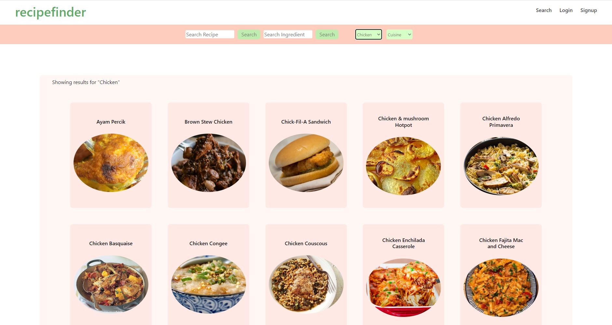

# Recipe Finder

[RecipeFinder]()

## Overview

Recipe Finder is a full-stack MERN (MongoDB, Express, React, Node.js) web application that allows users to search and save recipes. The app also allows users to find recipes based on ingredients or cuisine.

## Features

-Users can search for recipes using keywords, ingredients or cuisine.

-Users can create an account and save recipes for future reference.

-users can find recipes based on ingredients or cuisine

## Installation

To run the app locally, clone the repository and navigate to the root directory. Install dependencies using npm install.

You will also need to create a .env.themealdb file in the root directory and set the following environment variables: REACT_APP_THE_MEAL_DB_API_KEY (You can get api key from https://www.themealdb.com/api.php)

You will also need to create a .env file in the server directory and set the following environment variables: STRIPE_KEY (You can get api key from https://stripe.com/docs/api)

## Technologies Used

-MongoDB  
-Express  
-React  
-Node.js  
-JWT  
-Bootstrap / React Bootstrap / Icons  
-Stripe  
-Custom CSS  
-GraphQL  
-env-cmd (Protect sensitive key information on the client side)  
-API call from TheMealDB  

## Screenshots

## Contributors

[Vaishnavi Prakash](https://github.com/vaishnaviprakash12)
[Kahksha Bano](https://github.com/kahksha04)
## Acknowledgements

-This project was inspired by all those recipe websites that have complete life stories of the writer inserted into the page rather than getting right to the info you want.
